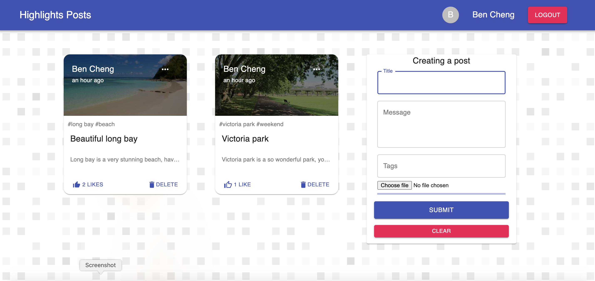

# Highlights Posts Application

This full-stack JavaScript application includes two main modules: posts management and user authentication. User can manage their own posts, and also like others. For login the app, user can use email and password, as well as Google account.

## What is it built on

- The backend is based on the Express, and MongoDB.
- The frontend is based on the React, Redux, and axios, etc.

## How do you run it locally

### Backend

In the 'server' directory, you need to run:

```
npm install
npm start
```

### Frontend

In the 'client' directory, you also need to run:

```
npm install
npm start
```

Afrer that, open a new browser to run

<http://localhost:3000/>

When complete, the app will look similar to that shown in the following screenshot:


